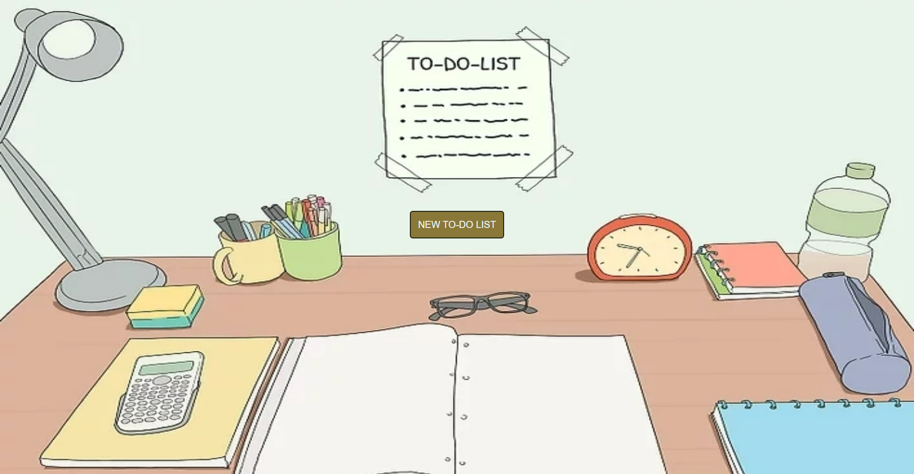
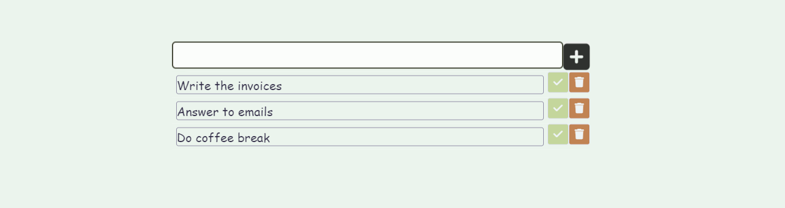
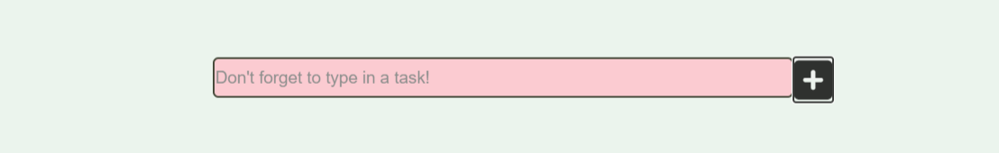
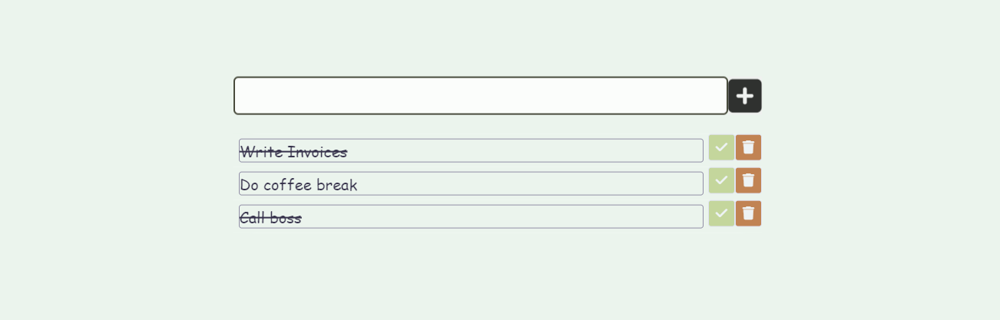
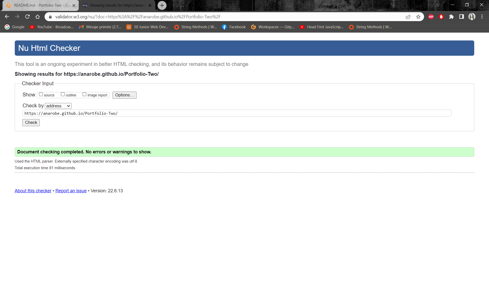
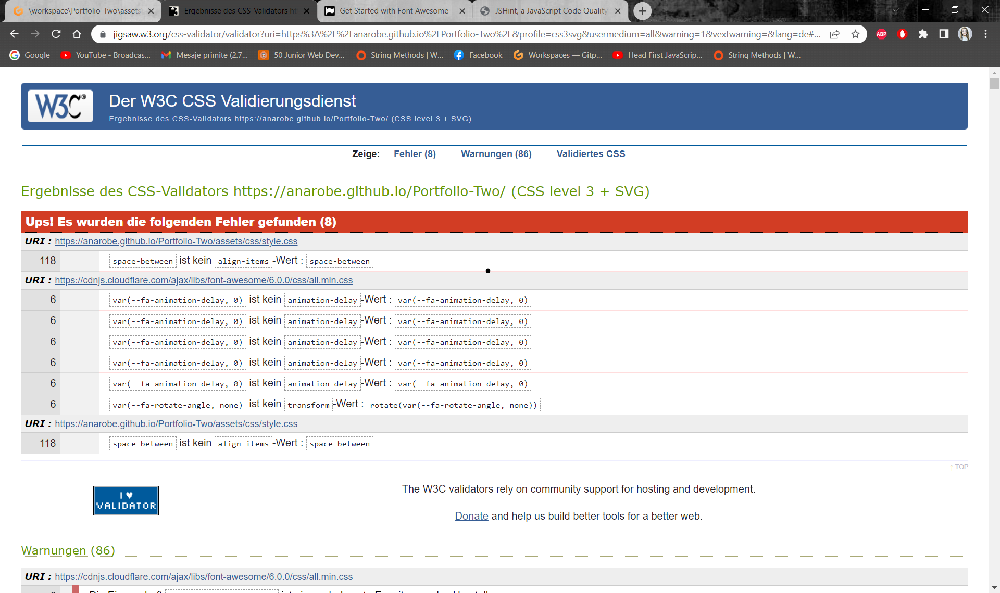
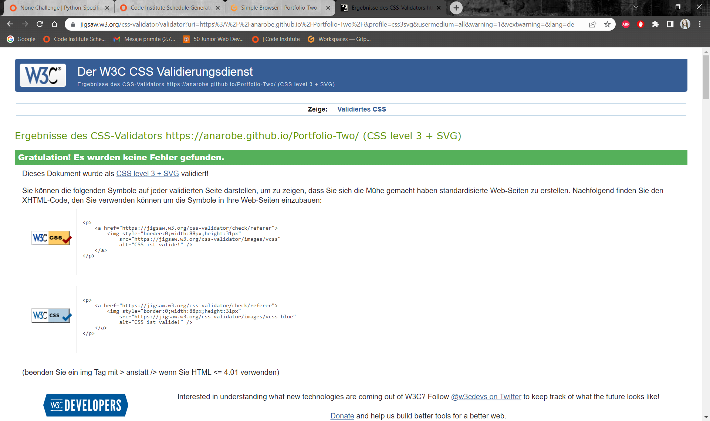
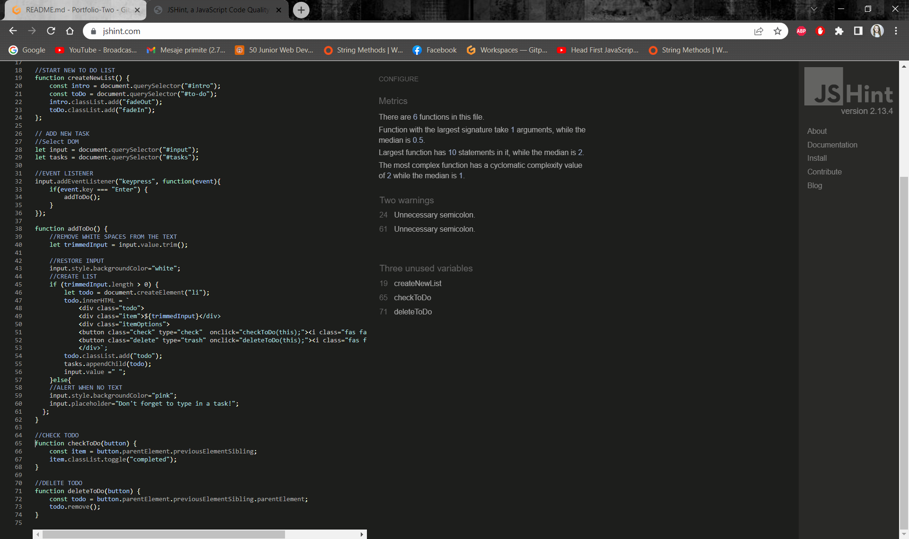
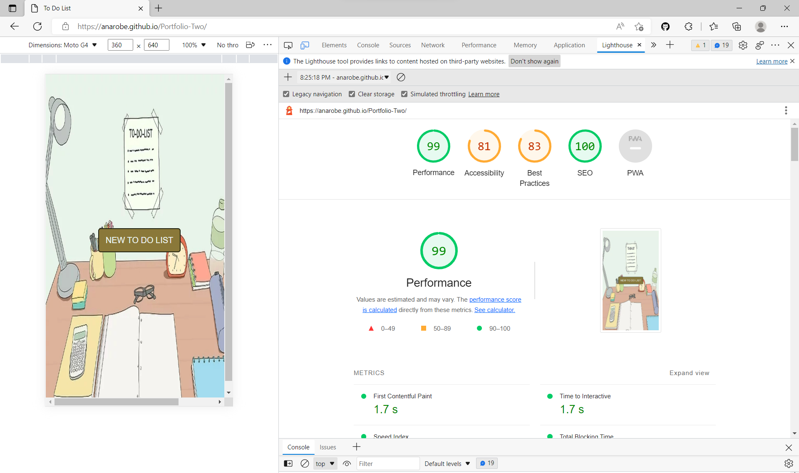
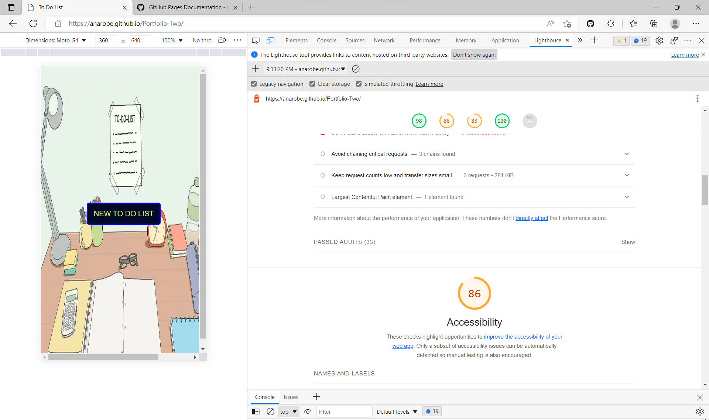

# ANa Robe

This To Do App was designed as a tool to create an overview of User's tasks helping to stay organised and increase productivity.

Therefore, the User will be able to stay more focused having an outline of what things has to do and the ones which are already already completed. 
Having tasks written in a list frees up space in user's mind and allows many more other benefits to come in place like improved memory and increased motivation.

This application contains 2 parts: 
- Intro Screen 
- Input Area.

Requirements for the project is that the Application  has to be interactive and responsive using HTML5, CSS3 and JavaScript.

A live version of the site can be found here: https://anarobe.github.io/Portfolio-Two/

## UX

The App was designed as a tool to create an overview of User's tasks by easily introducing and visiualising in real time the tasks which must be done.

### User Demographic

This App was designed for users who feel overwhelmed with the amount of work, forget to do exactly the important things
and struggle to keep to deadlines.

## External User's Goals

The User's goals are to ripe the benefits of increased productivity, staying motivated 

### App Owner's Goals

The main objective is to increase the productivity and deliver value to the company.He aims is to build practical application that will be 100% successful.

### Design

The design is a minimalistic one and was influenced by the home page's hero image - A desk with a notebook on top and a ToDo list sticked on the Wall.
The choice for Clip Art was made almost instantly, only by one google search because it enpictures exactly what this App wants to provide. 
By placing the Button right in the center of the screen, it invites the users to start a new session with only one click.

### Colour Scheme

With carefully chosen colors, the apearance of the input area and later the actual list + buttons, fits the main picture's theme.

### Hero Image
The Image have been chosen in accordance to the functionality of the app.

### Intro Screen

The role of the Intro Screen is to invite the user to start a new list of tasks by clicking the unique central button. This idea was inspired by watching the
 -------Rock paper scissors Tutorial https://www.youtube.com/watch?v=qWPtKtYEsN4&ab_channel=DevEd

### Input Area

The Input Area displays initially a text input where the user will type in the task. Next to this area the user can make use of the + button to add the text on the list or simply by pressing the Enter key. 

### Listing Area

The actual list will apear under the input by calling the addToDo() function.
This function wil check first if there is any text typed in the input. 
If there is none, the text's placeholder will turn pink and display the message: "Don't forget to type in a task!".
Also, through trim() function will check if there is any Space typed in the input alone.
Each task will be displayed under the input area in the order which was added. Every item is accompanied by two options 

1. Check Button - which will diplay the text whit a line-through

2. Delete Button - which has the function to remove the task

### Technologies Used

* HTML
* CSS
* JavaScript

### Testing

- I tested that this page works in different browsers: Chrome, Firefox, Microsoft Edge.

- I confirmed that this project is responsive, looks good and functions on all standard screen sizes using the devtools device toolbar.

- I confirmed that all elemnts which are clickable function accordingly.

### Validator testing

* HTML

- No errors were found using W3C HTML validator testing.

See screenshot below:

* CSS

Errors were found using W3C CSS validator testing. 

See screenshot below: 

- I have changed the cdnjs link  with 
 

See screenshot below: 

* JS

Beside a couple of a couple of unnecessary coulumns, no other errors were found using JSHint validator testing.See screenshot below:

* Lighthouse testing 

See screenshot below:

Because of a low score of accessibility I have decided to change the button's color in Intro Secreen.
Regarding the Hero Image,because of close deadline, I will take care of it later on.

See screenshot below:

### Testing and Bugs

Test has been conducted using Pythontutor and Google Chrome, testing different devices and screen resolutions through google dev tools.

## Main bugs I came across - JavaScript:

1. The first issue I came across was when making the addToDo() function and the placeholder turning pink. The feature suppose to turn pink and display the message : "Don't forget to type in a task!" when the user attempts to introduce no text. But after typing in text, the placehlder was keep staying pink. 
 The solution was to add background color white right when the function started. 

2. The next issue was that if the user would have typing one simple space, a new task would have been created and no text deisplayed. In this case my mentor suggested me to look up for trim() method. I have succesfully applied her advice.

3. By creating the functions for the Check and Delete buttons I found myself in the dificulty to delegate the function to each button when was clicked. The solution was to add "this" as atribute when the function was called onClick and "button" as parameter of the function. With this challange I also learned the part of getting the right elements.

### Deployment

The development platform used for this project was GitPod. To track the development stage and handle version control regular commits and pushes to GitHub has been conducted. The GitPod environment was created using a template provided by Code Institute.

The live version of the project is deployed at GitHub pages.

The procedure for deployment followed the "Creating your site" steps provided in GitHub Docs.

*Log into Github. *Select the correct GitHub Repository to be deployed live. *Underneath the repository name, click the “Settings” option. *In the sub-section list on the left, under “Code and automation”, click “Pages”. *Within the ”Source” section choose ”main” as Branch and root as folder and click ”Save”. *The page refreshes and a website shall then deploy via a link.

The live deployed link can be found here - https://anarobe.github.io/Portfolio-Two/

### Media

The photo used on the home page as background image is from This Open Source site https://www.wikihow.com/Make-a-To-Do-List

### Acknowledgements

 For inpiration in general, for code and advice, I'd like to give thanks to:

* Martina Terlevic
and
* Kasia Bogucka

### Sources
Youtube Tutorials that helped me to understand JavaScript and how to build functions:
https://www.youtube.com/c/WickedlySmart
https://www.youtube.com/watch?v=qRnUBiTJ66Y
https://www.youtube.com/watch?v=-pRg_daFjfk
https://www.youtube.com/c/TheCodingTrain
https://www.youtube.com/watch?v=qWPtKtYEsN4&ab_channel=DevEd
https://www.youtube.com/watch?v=Ttf3CEsEwMQ&ab_channel=DevEd

Sites that provided me with helpful information and resolved many of my issues::
https://stackoverflow.com/
https://www.freecodecamp.org/
https://jsmanifest.com/composing-in-javascript/
https://www.jschallenger.com/
hackernoon.comhackernoon.com
https://www.foolishdeveloper.com/2021/11/todo-list-javascript.html
https://www.w3schools.com/ 

The top screen shot for responsive design was taken from:

https://ui.dev/amiresponsive

Thank you